# Guia Detalhado de Implementação e Configuração: Automação de Análise de Logs (Bugsnag, n8n, ClickUp)

Este documento descreve os passos para construir uma automação robusta que captura eventos de monitoramento de erros do Bugsnag, os processa via n8n e cria ou atualiza tarefas no ClickUp, direcionando-as para agentes específicos através de um fluxo de trabalho em múltiplas etapas. As notificações são enviadas via Telegram para máxima simplicidade e eficiência.

## Introdução

A automação proposta visa otimizar o processo de tratamento de erros e logs críticos. Ao integrar o Bugsnag, que notifica sobre falhas em tempo real, com o ClickUp, uma plataforma de gerenciamento de tarefas, e utilizando o n8n como orquestrador, garantiremos que cada incidente seja rapidamente transformado em uma tarefa acionável e roteado para o profissional certo em cada fase do seu ciclo de vida. As notificações via Telegram garantem que a equipe seja alertada instantaneamente sobre novos incidentes e mudanças de status.

## 1. Pré-requisitos

### Para seguir este guia, você precisará dos seguintes recursos:

- **Conta Ativa no Bugsnag:** Ferramenta de monitoramento de erros para seus aplicativos.
- **Conta Ativa no ClickUp:** Plataforma de gerenciamento de tarefas e projetos.
- **Docker Instalado:** Essencial para a instalação e execução do n8n de forma fácil e isolada.
- **Conhecimento Básico de n8n:** Familiaridade com a interface, a criação de fluxos de trabalho e a funcionalidade dos nós.
- **Bot do Telegram (Opcional):** Para receber notificações em tempo real sobre incidentes e mudanças de status.

## 2. Instalação e Configuração do n8n

O n8n será o coração da sua automação. Recomenda-se a instalação via Docker para maior portabilidade e simplicidade.

### 2.1. Instalação do n8n via Docker

#### Método Automatizado (Recomendado)
```bash
# Linux/macOS
chmod +x setup.sh
./setup.sh

# Windows
.\setup.ps1
```

#### Método Manual
1. **Verifique a Instalação do Docker:** Certifique-se de que o Docker e o Docker Compose estejam instalados e funcionando em seu sistema.
2. **Execute o n8n:** Abra seu terminal ou prompt de comando e execute o seguinte comando:

    ```bash
    docker run -it --rm \
      --name n8n \
      -p 5678:5678 \
      -v ~/.n8n:/home/node/.n8n \
      n8nio/n8n
    ```

    *   `docker run -it --rm`: Inicia um container Docker interativo e o remove após a saída.
    *   `--name n8n`: Define o nome do container como "n8n".
    *   `-p 5678:5678`: Mapeia a porta 5678 do seu host para a porta 5678 do container, tornando o n8n acessível.
    *   `-v ~/.n8n:/home/node/.n8n`: Persiste os dados do n8n (credenciais, fluxos de trabalho) em um volume local no seu diretório `~/.n8n`.
    *   `n8nio/n8n`: Imagem Docker oficial do n8n.

    Este comando iniciará o n8n, e ele estará acessível via navegador.

### 2.2. Configuração Inicial do n8n

1.  **Acesse a Interface Web:** Após a execução do Docker, abra seu navegador e acesse `http://localhost:5678`.
2.  **Siga as Instruções:** A interface do n8n o guiará através de um processo de configuração inicial, que pode incluir a criação de uma conta de usuário ou a definição de configurações básicas.

## 3. Integração com o Bugsnag

O Bugsnag será a fonte dos logs e eventos que acionarão sua automação.

### 3.1. Obtenção do Token de Acesso do Bugsnag

Para que o n8n possa, se necessário, interagir com a API do Bugsnag (embora para webhooks não seja estritamente necessário), ou para ter acesso administrativo, você precisará de um token:

1.  **Acesse sua Conta Bugsnag:** Faça login na plataforma Bugsnag.
2.  **Navegue para Tokens:** Vá para "Minha Conta" (ou "Personal Settings") > "Tokens de Autenticação Pessoal".
3.  **Gere um Novo Token:** Crie um novo token e **copie-o imediatamente**, pois ele não será exibido novamente. Guarde-o em segurança.

### 3.2. Configuração de Webhooks no Bugsnag

Para que o Bugsnag envie notificações (logs de erro, eventos) diretamente para o n8n, você precisará configurar um webhook no Bugsnag. A URL do webhook será gerada no n8n.

1.  **No Bugsnag:** Navegue até as "Configurações do Projeto" do seu projeto específico.
2.  **Vá para Integrações:** Dentro das configurações do projeto, procure por "Integrações" ou "Encaminhamento de Dados" ("Data Forwarding").
3.  **Adicione um Novo Webhook:** Selecione a opção para adicionar um novo Webhook. Deixe esta tela aberta, pois você precisará colar a URL do n8n aqui no próximo passo.

## 4. Integração com o ClickUp

O ClickUp será o sistema de destino para suas tarefas (issues).

### 4.1. Obtenção do Token de Acesso do ClickUp

Para que o n8n possa criar e manipular tarefas no ClickUp, você precisará de uma chave de API.

1.  **Acesse sua Conta ClickUp:** Faça login na plataforma ClickUp.
2.  **Navegue para Aplicativos:** Vá para "Configurações" (Settings) > "Aplicativos" (Apps).
3.  **Gere um Novo Token de API:** Procure pela opção para gerar um "Token de API" (API Token). Copie este token e guarde-o com segurança.

### 4.2. Configuração das Credenciais do ClickUp no n8n

Agora você adicionará o token do ClickUp ao n8n, tornando-o disponível para todos os seus fluxos de trabalho.

1.  **No n8n:** No menu lateral esquerdo, clique em "Credenciais" (Credentials).
2.  **Adicione Nova Credencial:** Clique em "Nova Credencial" (New Credential) ou no botão `+`.
3.  **Selecione ClickUp API:** Na lista de tipos de credenciais, procure e selecione "ClickUp API".
4.  **Insira o Token:** Cole o "Token de API" do ClickUp que você obteve na seção anterior no campo apropriado e salve a credencial.

### 4.3. Identificação dos IDs dos Agentes no ClickUp

Para atribuir tarefas a agentes específicos, você precisará dos IDs de usuário deles no ClickUp. Existem algumas maneiras de obtê-los:

- **Via API do ClickUp:** Se você estiver confortável com a API, pode fazer uma requisição para listar os membros de um espaço de trabalho ou equipe e obter os IDs.
- **Inspeção Manual (método simples):**
    1.  No ClickUp, navegue até um perfil de usuário ou uma tarefa atribuída a ele.
    2.  O ID do usuário pode aparecer na URL (ex: `app.clickup.com/2021.../tasks/taskid?assignee_id=**USUARIO_ID**`).
    3.  Alternativamente, você pode usar um nó "ClickUp" no n8n para "Listar Usuários" e ver os IDs retornados. Anote os IDs dos agentes que você planeja atribuir em cada etapa.

## 5. Configuração do Telegram para Notificações

O Telegram será usado para enviar notificações em tempo real sobre incidentes e mudanças de status.

### 5.1. Criação do Bot do Telegram

1. **Acesse o BotFather:** No Telegram, procure por @BotFather e inicie uma conversa.
2. **Crie um Novo Bot:** Envie o comando `/newbot` e siga as instruções:
   - Digite um nome para o bot (ex: "LogAnalyze Notifications")
   - Digite um username para o bot (deve terminar em 'bot', ex: "loganalyze_bot")
3. **Copie o Token:** O BotFather retornará um token. Copie-o e guarde-o com segurança.

### 5.2. Obtenção do Chat ID

#### Para Chat Privado:
1. Adicione o bot como contato
2. Envie uma mensagem para o bot
3. Acesse: `https://api.telegram.org/bot<SEU_TOKEN>/getUpdates`
4. Procure pelo `chat.id` na resposta JSON

#### Para Grupo:
1. Adicione o bot ao grupo
2. Envie uma mensagem no grupo
3. Acesse: `https://api.telegram.org/bot<SEU_TOKEN>/getUpdates`
4. Procure pelo `chat.id` na resposta JSON (será um número negativo)

#### Para Canal:
1. Adicione o bot como administrador do canal
2. Publique uma mensagem no canal
3. Acesse: `https://api.telegram.org/bot<SEU_TOKEN>/getUpdates`
4. Procure pelo `chat.id` na resposta JSON (será algo como `-1001234567890`)

### 5.3. Configuração das Credenciais do Telegram no n8n

1. **No n8n:** No menu lateral esquerdo, clique em "Credenciais" (Credentials).
2. **Adicione Nova Credencial:** Clique em "Nova Credencial" (New Credential) ou no botão `+`.
3. **Selecione Telegram API:** Na lista de tipos de credenciais, procure e selecione "Telegram API".
4. **Insira o Token:** Cole o token do bot que você obteve do BotFather no campo apropriado e salve a credencial.

## 6. Criação do Fluxo de Trabalho no n8n

Esta é a parte central da automação, onde você desenhará o fluxo de análise de logs.

### 6.1. Nó de Gatilho: Webhook (Recebimento de Eventos do Bugsnag)

Este nó será o ponto de entrada da sua automação, aguardando os eventos do Bugsnag.

1.  **Adicione um Nó "Webhook":** No seu novo fluxo de trabalho no n8n, adicione o nó "Webhook" (Trigger).
2.  **Configure o Método HTTP:** No nó "Webhook", selecione o "HTTP Method" como `POST`.
3.  **Copie a URL do Webhook:** O n8n gerará uma "Webhook URL" para este nó. Copie-a.
4.  **Cole no Bugsnag:** Volte para as "Configurações do Projeto" no Bugsnag (Seção 3.2), e cole esta "Webhook URL" no campo correspondente para o novo Webhook. Salve no Bugsnag.

### 6.2. Processamento dos Dados do Bugsnag (Nó "Set" ou "Function")

Após receber o payload do Bugsnag, você precisará extrair e organizar os dados relevantes para o ClickUp.

1.  **Adicione um Nó "Set" (ou "Function"):** Conecte este nó ao nó "Webhook".
2.  **Configure os Campos:**
    *   Use o nó "Set" para mapear os dados do JSON recebido do Bugsnag para variáveis mais legíveis e estruturadas, como `title`, `description`, `severity`, `error_url`, etc.
    *   **Exemplo:**
        *   `title` do Bugsnag para `Título da Tarefa no ClickUp`.
        *   `message` do Bugsnag para `Descrição da Tarefa no ClickUp`.
    *   Se a lógica de extração for complexa ou você precisar de manipulação de dados mais avançada, utilize um nó "Function" (JavaScript) para parsear o JSON e criar um objeto com as propriedades desejadas.

### 6.3. Criação da Tarefa no ClickUp (Nó "ClickUp")

Este nó criará a tarefa inicial no ClickUp com base nos dados processados.

1.  **Adicione um Nó "ClickUp":** Conecte-o ao nó de processamento de dados.
2.  **Selecione a Ação:** Em "Operation", escolha "Create" (para criar uma nova tarefa).
3.  **Mapeie os Campos:**
    *   **Credential:** Selecione a credencial do ClickUp que você configurou.
    *   **Workspace:** Selecione seu Workspace do ClickUp.
    *   **Space:** Selecione o Space onde as tarefas serão criadas.
    *   **List:** Escolha a Lista específica para as issues de log.
    *   **Name:** Use a variável de `title` do nó anterior.
    *   **Description:** Use a variável de `description` do nó anterior.
    *   **Priority:** Mapeie a gravidade do Bugsnag para a prioridade do ClickUp (ex: `error` -> `High`, `warning` -> `Normal`).
    *   **Assignees:** Atribua o ID do agente responsável pela etapa de "Recebimento" ou "Análise Inicial" (Seção 4.3).

### 6.4. Notificação via Telegram (Nó "Telegram")

Este nó enviará uma notificação imediata via Telegram sobre o novo incidente.

1.  **Adicione um Nó "Telegram":** Conecte-o ao nó de criação da tarefa.
2.  **Configure os Campos:**
    *   **Credential:** Selecione a credencial do Telegram que você configurou.
    *   **Chat ID:** Use a variável de ambiente `{{ $env.TELEGRAM_CHAT_ID }}`.
    *   **Text:** Configure a mensagem com os detalhes do incidente.
    *   **Parse Mode:** Selecione "Markdown" para formatação.

### 6.5. Definição das Etapas do Fluxo de Trabalho (Ciclo de Vida da Tarefa)

Para cada uma das suas etapas (Recebimento, Análise, Rascunho, Revisão, Refinamento, Criação, Notificação), você precisará de uma sequência de nós.

**Modelo para Cada Etapa (repetir para Análise, Rascunho, Revisão, Refinamento, Criação):**

1.  **Nó "Set" (Atualiza Status/Dados Internos):**
    *   **Propósito:** Marca a transição para a próxima fase.
    *   **Configuração:** Adicione um campo para indicar o "Status Atual" no n8n (e.g., `status: "Em Análise"`).

2.  **Nó "ClickUp" (Atualiza Tarefa no ClickUp):**
    *   **Propósito:** Atualiza o status da tarefa e o responsável no ClickUp.
    *   **Configuração:**
        *   **Operation:** "Update" (Task).
        *   **Task ID:** Use o ID da tarefa que foi criada no passo anterior (`{{ $node["ClickUp"].json["id"] }}`).
        *   **Status:** Defina o status da tarefa no ClickUp (ex: "Em Análise", "Em Revisão").
        *   **Assignees:** Atribua o ID do agente responsável pela etapa atual.

3.  **Nó "Telegram" (Notificação de Mudança de Status):**
    *   **Propósito:** Notifica o agente responsável pela próxima etapa via Telegram.
    *   **Configuração:**
        *   **Chat ID:** Use a variável de ambiente `{{ $env.TELEGRAM_CHAT_ID }}`.
        *   **Text:** Configure a mensagem com detalhes da tarefa e o que o agente precisa fazer.
        *   **Parse Mode:** Selecione "Markdown" para formatação.

4.  **Nó "Wait" (Se Necessário Intervenção Humana):**
    *   **Propósito:** Pausar o fluxo e aguardar uma ação ou aprovação do agente antes de avançar.
    *   **Configuração:**
        *   O nó "Wait" pode ser configurado para aguardar um determinado período ou para aguardar a chamada de um webhook externo (o que exigiria uma ação manual do agente, como clicar em um botão de "Aprovar" em uma notificação que, por sua vez, acionaria outro webhook para continuar o fluxo). Para este cenário, o "Wait" é mais complexo, mas muito poderoso. Uma alternativa mais simples é que o próprio agente altere o status da tarefa no ClickUp, e um segundo fluxo n8n observe essa mudança de status para acionar a próxima fase.

### 6.6. Atribuição Dinâmica de Agentes

Para cada etapa, você pode usar os IDs de usuário que obteve anteriormente (Seção 4.3).

*   No nó "ClickUp" de atualização de tarefa, configure o campo "Assignees" com o ID do usuário correspondente à etapa.
*   **Exemplo:**
    *   Etapa "Recebimento": `Assignees: [ID_AGENTE_RECEBIMENTO]`
    *   Etapa "Análise": `Assignees: [ID_AGENTE_ANALISE]`
    *   ...e assim por diante.
*   **Lógica Avançada:** Para atribuições mais complexas (ex: rodízio de agentes, atribuição baseada em tags ou prioridade), você pode usar um nó "Function" para implementar a lógica e então passar o ID do agente resultante para o nó "ClickUp".

### 6.7. Etapa Final: Notificação de Conclusão

No final do fluxo, após a "Criação" (resolução ou conclusão da tarefa), você terá uma notificação final via Telegram.

*   **Nó "Telegram":** Envie uma notificação para a equipe relevante informando que a issue de log foi resolvida ou tratada.

### 6.8. Diagrama de Workflow

Abaixo está o diagrama do fluxo de funcionamento da automação de análise de logs, integrando Bugsnag, n8n, ClickUp e Telegram. O diagrama é representado utilizando a sintaxe do Mermaid, que permite a criação de diagramas de forma textual e é amplamente suportada em diversas plataformas.

```mermaid
graph TD
    A[Recebimento de Logs do Bugsnag] -->|Webhook inicia fluxo no n8n| B[Processamento e Orquestração no n8n]
    B --> C[Criação/Atualização de Issue no ClickUp]
    C --> D[Notificação via Telegram]
    D --> E{Etapa: Recebimento}
    E --> F{Etapa: Análise}
    F --> G{Etapa: Rascunho}
    G --> H{Etapa: Revisão}
    H --> I{Etapa: Refinamento}
    I --> J{Etapa: Criação}
    J --> K{Etapa: Notificação Final}
    K --> L[Notificação de Conclusão via Telegram]
    
    %% Definição de agentes responsáveis por cada etapa (no ClickUp, gerenciado pelo n8n)
    E:::agent1
    F:::agent2
    G:::agent3
    H:::agent4
    I:::agent5
    J:::agent6
    K:::agent7

    %% Estilos para diferenciar os agentes ou tipos de etapas
    classDef agent1 fill:#f9f,stroke:#333,stroke-width:2px;
    classDef agent2 fill:#9f9,stroke:#333,stroke-width:2px;
    classDef agent3 fill:#99f,stroke:#333,stroke-width:2px;
    classDef agent4 fill:#ff9,stroke:#333,stroke-width:2px;
    classDef agent5 fill:#f99,stroke:#333,stroke-width:2px;
    classDef agent6 fill:#9ff,stroke:#333,stroke-width:2px;
    classDef agent7 fill:#ccc,stroke:#333,stroke-width:2px;
    
    %% Para dar um formato diferente às etapas de fluxo de trabalho no ClickUp
    classDef stage shape:rhombus;
    class E,F,G,H,I,J,K stage;
```



### 6.9. Descrição do Fluxo:

1.  **Recebimento de Logs do Bugsnag (A):** O fluxo se inicia quando o Bugsnag detecta um erro ou evento relevante e envia os detalhes para o n8n através de um webhook configurado.

2.  **Processamento e Orquestração no n8n (B):** O n8n recebe os dados do Bugsnag. Neste nó, o n8n processa as informações, extrai os detalhes importantes (como tipo de erro, mensagem, contexto) e decide qual ação tomar em seguida.

3.  **Criação/Atualização de Issue no ClickUp (C):** Com base nos dados processados, o n8n cria automaticamente uma nova tarefa (issue) no ClickUp. Se já existir uma issue para um erro recorrente, o n8n pode atualizá-la em vez de criar uma nova.

4.  **Notificação via Telegram (D):** Imediatamente após a criação da tarefa, uma notificação é enviada via Telegram para alertar a equipe sobre o novo incidente.

5.  **Etapa: Recebimento (E):** A tarefa recém-criada é movida para a etapa de "Recebimento" no ClickUp e atribuída ao **Agente 1**. Este agente é responsável por confirmar que a issue foi registrada com sucesso e está pronta para ser analisada.

6.  **Etapa: Análise (F):** Após o recebimento, a tarefa avança para a etapa de "Análise" e é atribuída ao **Agente 2**. Neste ponto, o agente investiga a causa raiz do erro, buscando entender o contexto e o impacto.

7.  **Etapa: Rascunho (G):** Concluída a análise, a tarefa segue para a etapa de "Rascunho", sob a responsabilidade do **Agente 3**. Aqui, é elaborado um rascunho de solução ou um plano de ação para resolver o problema.

8.  **Etapa: Revisão (H):** O rascunho é então enviado para "Revisão", com o **Agente 4** como responsável. Este agente verifica a viabilidade e a correção da solução proposta.

9.  **Etapa: Refinamento (I):** Com base no feedback da revisão, a tarefa entra na etapa de "Refinamento", atribuída ao **Agente 5**. Aqui, são feitos os ajustes finais no plano de ação.

10. **Etapa: Criação (J):** O plano refinado é encaminhado para a etapa de "Criação" (ou Implementação), sendo o **Agente 6** o responsável. Esta fase envolve a execução da solução proposta.

11. **Etapa: Notificação Final (K):** Após a conclusão da "Criação", a tarefa passa para uma etapa de "Notificação Final", com o **Agente 7** supervisionando. Esta etapa garante que todas as partes interessadas estejam cientes da resolução.

12. **Notificação de Conclusão via Telegram (L):** Finalmente, o n8n envia uma notificação final via Telegram para os agentes e equipes relevantes, informando sobre a conclusão do processo e as próximas etapas, se houver.

### 6.10. Notas Adicionais:

- Cada "Etapa" no ClickUp pode ser representada por um status ou uma coluna específica, e a transição entre elas é controlada pelo n8n, que atualiza a tarefa e o responsável.
- As cores e formatos dos nós de etapa (**E** a **K**) foram estilizados para diferenciá-los visualmente, indicando que são fases distintas do fluxo de trabalho.
- A atribuição de agentes é gerenciada dinamicamente pelo n8n, garantindo que a pessoa certa seja notificada e tenha a tarefa atribuída em cada fase.
- As notificações via Telegram garantem que a equipe seja alertada em tempo real sobre mudanças de status e novos incidentes.
- A flexibilidade do n8n permite adicionar mais ramificações ou condições, como, por exemplo, um retorno à etapa de "Rascunho" ou "Análise" se a "Revisão" encontrar problemas.

## 7. Configuração de Ambiente e Variáveis

### 7.1. Variáveis de Ambiente

Configure as seguintes variáveis no arquivo `.env`:

```bash
# Configurações do n8n
N8N_BASIC_AUTH_USER=admin
N8N_BASIC_AUTH_PASSWORD=admin123
N8N_HOST=localhost
N8N_PORT=5678
N8N_PROTOCOL=http

# Configurações do Bugsnag
BUGSNAG_API_TOKEN=your_bugsnag_api_token_here
BUGSNAG_PROJECT_ID=your_project_id_here

# Configurações do ClickUp
CLICKUP_API_TOKEN=your_clickup_api_token_here
CLICKUP_WORKSPACE_ID=your_workspace_id_here
CLICKUP_SPACE_ID=your_space_id_here
CLICKUP_LIST_ID=your_list_id_here

# IDs dos Agentes (obtidos via API do ClickUp)
AGENT_RECEBIMENTO_ID=agent_id_1
AGENT_ANALISE_ID=agent_id_2
AGENT_RASCUNHO_ID=agent_id_3
AGENT_REVISAO_ID=agent_id_4
AGENT_REFINAMENTO_ID=agent_id_5
AGENT_CRIACAO_ID=agent_id_6
AGENT_NOTIFICACAO_ID=agent_id_7

# Configurações de Notificação - Telegram
TELEGRAM_BOT_TOKEN=your_telegram_bot_token_here
TELEGRAM_CHAT_ID=your_chat_id_here
TELEGRAM_CHANNEL_ID=your_channel_id_here

# Configurações de Notificação - Slack (Alternativo)
SLACK_WEBHOOK_URL=your_slack_webhook_url_here

# Configurações de Notificação - Email (Alternativo)
EMAIL_SMTP_HOST=smtp.gmail.com
EMAIL_SMTP_PORT=587
EMAIL_USER=your_email@gmail.com
EMAIL_PASSWORD=your_app_password_here
```

### 7.2. Configuração do ClickUp

#### Status Necessários
Configure os seguintes status na sua lista do ClickUp:
- Recebimento
- Análise
- Rascunho
- Revisão
- Refinamento
- Criação
- Concluído

#### Campos Customizados (Opcional)
Adicione os seguintes campos customizados:
- `severity` (texto)
- `error_url` (texto)
- `project_id` (texto)
- `error_id` (texto)
- `timestamp` (data)

## 8. Teste e Validação

É crucial testar o fluxo de trabalho exaustivamente.

### 8.1. Teste Automatizado

```bash
# Execute o script de teste
./test-webhook.sh
```

### 8.2. Teste Manual

1.  **Gere um Erro de Teste no Bugsnag:** Use um projeto de teste no Bugsnag para forçar a ocorrência de um erro que acione o webhook.
2.  **Verifique a Criação da Tarefa no ClickUp:** Acesse o ClickUp e certifique-se de que a tarefa foi criada corretamente, com os dados mapeados e o agente inicial atribuído.
3.  **Verifique a Notificação no Telegram:** Confirme que a notificação foi enviada para o chat/grupo configurado.
4.  **Acompanhe o Fluxo no n8n:** No n8n, observe a execução do seu fluxo de trabalho. Você pode usar a visualização de "Execuções" (Executions) para ver cada passo.
5.  **Interaja como Agente:** Simule as ações dos agentes em cada etapa (ex: altere o status da tarefa no ClickUp para "Em Análise", ou clique em aprovar se você implementou o nó "Wait").
6.  **Confirme Notificações:** Verifique se as notificações do Telegram foram enviadas corretamente para os agentes apropriados em cada transição.

## 9. Monitoramento e Manutenção

Após a implementação, a automação requer atenção contínua.

### 9.1. Logs do n8n

```bash
# Ver logs em tempo real
docker-compose logs -f n8n

# Ver logs das últimas 100 linhas
docker-compose logs --tail=100 n8n
```

### 9.2. Métricas de Execução

- Acesse: http://localhost:5678/executions
- Monitore execuções bem-sucedidas vs falhas
- Verifique tempo de execução

### 9.3. Manutenção Regular

- **Revise Logs do n8n:** Monitore os logs de execução do n8n para identificar quaisquer falhas ou gargalos no fluxo de trabalho.
- **Atualize Credenciais:** Fique atento às datas de expiração de tokens e API keys do Bugsnag, ClickUp e Telegram. Atualize as credenciais no n8n conforme necessário.
- **Ajustes e Otimizações:** Colete feedback dos agentes envolvidos no processo. Isso pode revelar oportunidades para otimizar o fluxo de trabalho, adicionar novas condições ou melhorar as notificações.
- **Documentação:** Mantenha uma documentação clara do seu fluxo de trabalho no n8n, descrevendo a lógica de cada nó e as responsabilidades dos agentes.

### 9.4. Backup e Recuperação

```bash
# Backup dos dados do n8n
docker run --rm -v loganalyze_n8n_n8n_data:/data -v $(pwd):/backup alpine tar czf /backup/n8n-backup-$(date +%Y%m%d).tar.gz -C /data .

# Atualização
docker-compose pull
docker-compose up -d
```

## 10. Troubleshooting

### 10.1. Problemas Comuns

#### n8n não inicia
```bash
# Verificar logs
docker-compose logs n8n

# Reiniciar container
docker-compose restart n8n
```

#### Webhook não recebe dados
```bash
# Verificar se o webhook está ativo
curl http://localhost:5678/webhook/bugsnag-webhook

# Verificar logs do n8n
docker-compose logs -f n8n
```

#### Erro de credenciais ClickUp
1. Verifique se o token está correto
2. Verifique se o token tem permissões adequadas
3. Teste a API diretamente:
```bash
curl -H "Authorization: YOUR_TOKEN" \
  "https://api.clickup.com/api/v2/user"
```

#### Telegram não envia mensagens
1. Verifique se o bot token está correto
2. Verifique se o chat ID está correto
3. Teste a API do Telegram:
```bash
curl "https://api.telegram.org/bot<SEU_TOKEN>/sendMessage" \
  -d "chat_id=<SEU_CHAT_ID>" \
  -d "text=Teste de mensagem"
```

#### IDs de agentes incorretos
```bash
# Listar todos os usuários
curl -H "Authorization: YOUR_TOKEN" \
  "https://api.clickup.com/api/v2/team" | jq '.teams[].members[] | {id: .user.id, name: .user.username, email: .user.email}'
```

### 10.2. Cenários de Emergência

#### n8n Indisponível
1. Verificar se o container está rodando: `docker-compose ps`
2. Reiniciar: `docker-compose restart n8n`
3. Se persistir, verificar logs: `docker-compose logs n8n`

#### Bugsnag Não Enviando Dados
1. Verificar configuração do webhook no Bugsnag
2. Testar webhook manualmente: `./test-webhook.sh`
3. Verificar se a URL está acessível externamente

#### ClickUp API Indisponível
1. Verificar status da API: https://status.clickup.com/
2. Verificar token de API
3. Implementar retry logic no workflow

#### Telegram Indisponível
1. Verificar status da API: https://api.telegram.org/
2. Verificar token do bot
3. Verificar se o bot não foi bloqueado

## 11. Otimizações e Melhorias

### 11.1. Performance

- Monitorar tempo de execução do workflow
- Otimizar queries do ClickUp
- Implementar cache quando apropriado

### 11.2. Escalabilidade

- Considerar múltiplas instâncias do n8n
- Implementar load balancing
- Usar banco de dados externo para n8n

### 11.3. Segurança

- Usar HTTPS em produção
- Implementar autenticação forte
- Rotacionar tokens regularmente
- Monitorar logs de acesso

### 11.4. Resiliência

- Implementar retry logic
- Circuit breaker para APIs externas
- Backup automático

### 11.5. Vantagens do Telegram vs Slack

#### Telegram
- ✅ **Gratuito** sem limitações
- ✅ **Fácil configuração** (apenas bot token + chat ID)
- ✅ **Suporte nativo** no n8n
- ✅ **Notificações push** no celular
- ✅ **Grupos e canais** ilimitados
- ✅ **API estável** e bem documentada

#### Slack
- ❌ **Limitações** no plano gratuito
- ❌ **Configuração mais complexa** (webhook URLs)
- ❌ **Dependência** de workspace
- ❌ **Rate limits** mais restritivos

## 12. Estrutura do Projeto

```
loganalyze_n8n/
├── docker-compose.yml      # Configuração Docker
├── env.example             # Exemplo de variáveis de ambiente
├── setup.sh               # Script de setup (Linux/macOS)
├── setup.ps1              # Script de setup (Windows)
├── test-webhook.sh        # Script de teste do webhook
├── workflow.json          # Fluxo de trabalho n8n
├── IMPLEMENTACAO.md       # Guia prático de implementação
├── PROJETO.md             # Este documento
└── readme.md              # README principal
```

## 13. Conclusão

Este guia fornece um roteiro completo para implementar sua automação. Com o n8n, a flexibilidade para adaptar e expandir este fluxo de trabalho é praticamente ilimitada, permitindo que você refine o processo de análise de logs de acordo com as necessidades da sua equipe.

A automação proposta oferece:
- **Rapidez**: Detecção e criação de tarefas em tempo real
- **Rastreabilidade**: Fluxo completo documentado e monitorado
- **Escalabilidade**: Fácil adaptação para diferentes volumes e necessidades
- **Flexibilidade**: Possibilidade de adicionar novas etapas ou condições
- **Integração**: Conexão perfeita entre ferramentas de monitoramento e gestão
- **Notificações**: Alertas em tempo real via Telegram para máxima eficiência

A escolha do Telegram como plataforma de notificação oferece vantagens significativas em termos de simplicidade, custo e funcionalidade, tornando o sistema mais acessível e eficiente para equipes de todos os tamanhos.

---

**Desenvolvido com ❤️ para automação de análise de logs** 